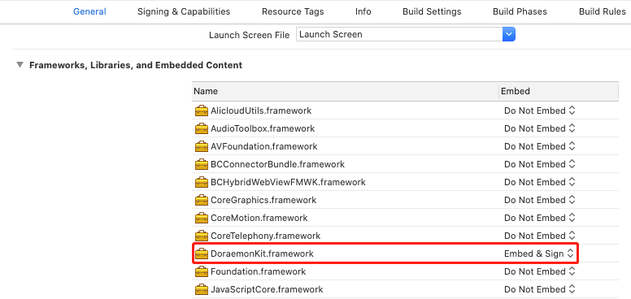

# react-native-doraemonkit

## 安装

```sh
yarn add react-native-doraemonkit
react-native link react-native-doraemonkit
```

## 额外配置

Framework添加

`Build Settings`->`Framework search Patchs`添加下面路径

```
$(PROJECT_DIR)/../node_modules/react-native-doraemonkit/ios/frameworks
```

`General`->`Frameworks,libraries,and Embedded Content`添加`node_modules/react-native-doraemonkit/ios/frameworks/`目录下`Doraemonkit.framework`文件，并确保`Embed`选项为`Embed & Sign`



AppDelegate.m文件中

```objective-c
- (NSURL *)sourceURLForBridge:(RCTBridge *)bridge
{
#if DEBUG
  //return [[RCTBundleURLProvider sharedSettings] jsBundleURLForBundleRoot:@"index" fallbackResource:nil];
  return [RNDoraemonkit bundleURL];
#else
  return [RNPatcher bundleURL];
#endif
}

- (NSArray<id<RCTBridgeModule>> *)extraModulesForBridge:(RCTBridge *)bridge
{  
  NSArray<id<RCTBridgeModule>> *extraModules = [NSArray arrayWithObjects:[RNDoraemonkit shareInstance], nil];
  return extraModules;
}
```

## 使用

`AppDelegate`的`didFinishLaunchingWithOptions`回调中添加`Doraemonkit`工具的初始化调用

```objective-c
- (BOOL)application:(UIApplication *)application didFinishLaunchingWithOptions:(NSDictionary *)launchOptions
{
  ... 
  [[DoraemonManager shareInstance] addPluginWithTitle:@"Reload" icon:@"doraemon_default" desc:@"客户端代码Reload" pluginName:@"RNReloadPlugin" atModule:@"RNDevTool"];
  [[DoraemonManager shareInstance] addPluginWithTitle:@"ClientServer" icon:@"doraemon_default" desc:@"客户端代码服务器选择" pluginName:@"RNClientServerListPlugin" atModule:@"RNDevTool"];
  [[DoraemonManager shareInstance] addPluginWithTitle:@"AppConfig" icon:@"doraemon_default" desc:@"App配置" pluginName:@"RNAppConfigPlugin" atModule:@"RNDevTool"];
  [[DoraemonManager shareInstance] addPluginWithTitle:@"Log" icon:@"doraemon_default" desc:@"日志查看" pluginName:@"DoraemonWeexLogPlugin" atModule:@"RNDevTool"];
  [[DoraemonManager shareInstance] install];
  ...

  return YES;
}
```


